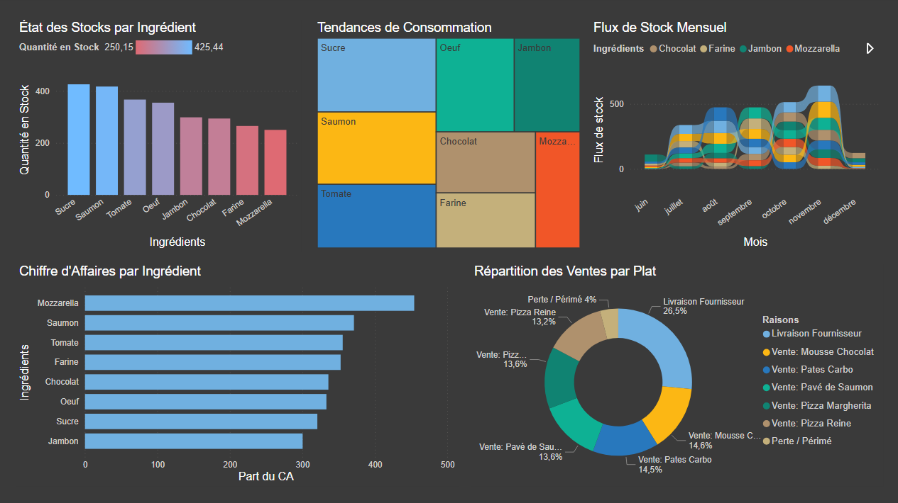

# 📦 Mini ERP Stock


Une application de gestion de stock Full-Stack (Django + React) entièrement dockerisée.
Le projet permet de gérer des produits, suivre les quantités en temps réel et visualiser la valeur du stock, le tout orchestré via Docker Compose.

## 🛠 Stack Technique

* **Infrastructure** : Docker & Docker Compose
* **Backend** : Python 3.13, Django 6.0, Django REST Framework
* **Frontend** : Node.js (Latest), React, TypeScript, Vite
* **Base de données** : PostgreSQL 15

## 📋 Prérequis

L'avantage de cette architecture est que vous n'avez **pas** besoin d'installer Python, Node.js ou PostgreSQL sur votre machine.

Les seuls outils nécessaires sont :

* **Git**
* **Docker** (Desktop ou Engine) avec le plugin **Docker Compose**

## 🚀 Installation & Démarrage Rapide

Suivez ces étapes pour lancer le projet en quelques minutes.

### 1. Cloner le projet
Récupérez le code source sur votre machine :

```bash
git clone https://github.com/Evedbs/mini-erp-stock.git
cd mini-erp-stock
```

### 2. Lancer l'environnement
Cette commande va construire les images (Backend & Frontend), télécharger la base de données et tout connecter automatiquement :

```bash
docker compose up --build
```

☕ Note : Attendez que les logs indiquent que le serveur Django et Vite sont prêts (messages verts).

### 3. Initialisation (Premier lancement uniquement)
Lors du tout premier démarrage, la base de données est vide. Ouvrez un nouveau terminal (en restant dans le dossier du projet) pour créer les tables et l'administrateur :

```bash
# 1. Créer les tables dans la base de données
docker compose exec web python manage.py migrate

# 2. Créer un compte administrateur (Suivez les instructions interactives)
docker compose exec web python manage.py createsuperuser
```

## 🌍 Accès à l'application
Une fois les conteneurs lancés, l'application est accessible via votre navigateur :
* Frontend (Application React) : http://localhost:5173
* Backend (Administration Django) : http://localhost:8000/admin
* API (Browsable API) : http://localhost:8000/api/

## 🕹 Commandes Utiles (Cheatsheet)
Voici les commandes principales à exécuter depuis la racine du projet (mini-erp-stock/) :

| Action               | Commande                     | Description                                                                                         |
| -------------------- | ---------------------------- | ----------------------------------------------------------------------------------------------------|
| Démarrer             | docker compose up            | Lance tous les services.                                                                            |
| Arrêter              | Ctrl + C                     | Arrête les conteneurs proprement (les données sont conservées).                                     |
| Mettre à jour        | docker compose up --build    | À lancer si vous modifiez le Dockerfile ou ajoutez des dépendances (requirements.txt / package.json). |
| Redémarrer le Back   | docker compose restart web   | Utile si le rechargement automatique Django échoue.                                                 |
| Entrer dans le Back  | docker compose exec web bash | Ouvre un terminal à l'intérieur du conteneur Django pour déboguer.                                  |
| Tout nettoyer        | docker compose down -v       | ⚠️ Zone de danger : Supprime les conteneurs ET efface la base de données (repart à zéro).            |

## 📊 Business Intelligence & Data Analysis

Le projet inclut un pipeline de données permettant de piloter l'exploitation du restaurant. En se connectant directement à la base PostgreSQL, le rapport Power BI permet de répondre aux problématiques suivantes :

* **Optimisation des achats** : Identification des ingrédients à forte rotation pour éviter les ruptures.
* **Suivi de la rentabilité** : Calcul du chiffre d'affaires estimé basé sur les sorties de stock réelles.
* **Contrôle du gaspillage** : Analyse isolée des mouvements pour motif "Perte/Périmé" afin d'ajuster les quantités produites.
* **Popularité du menu** : Visualisation du mix-produit (ventes par type de plat).



> **Architecture Data** : Un script Python simule 6 mois de flux (1000+ entrées/sorties) pour tester la robustesse des calculs DAX et la réactivité des visuels face à un volume de données réaliste.

## 📂 Structure du projet
L'architecture est organisée pour séparer clairement les responsabilités, unifiées par le fichier Docker Compose à la racine.
```bash
mini-erp-stock/
├── docker-compose.yml   # Le "Chef d'Orchestre" qui pilote tout
├── README.md            # Documentation
├── backend/             # Application Django (API)
│   ├── Dockerfile        # Recette de construction du Backend
│   ├── manage.py
│   ├── requirements.txt
│   └── ...
└── frontend/            # Application React (Interface)
    ├── Dockerfile        # Recette de construction du Frontend
    ├── package.json
    ├── src/
    └── ...
```
